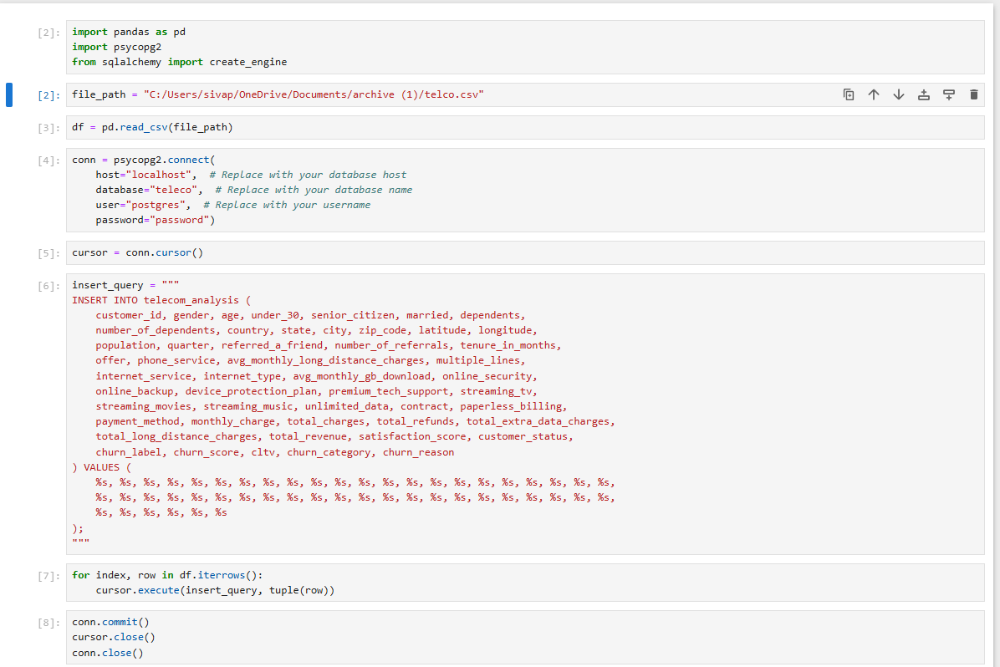
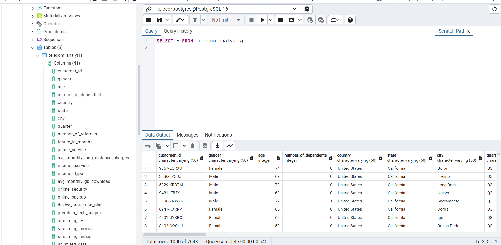
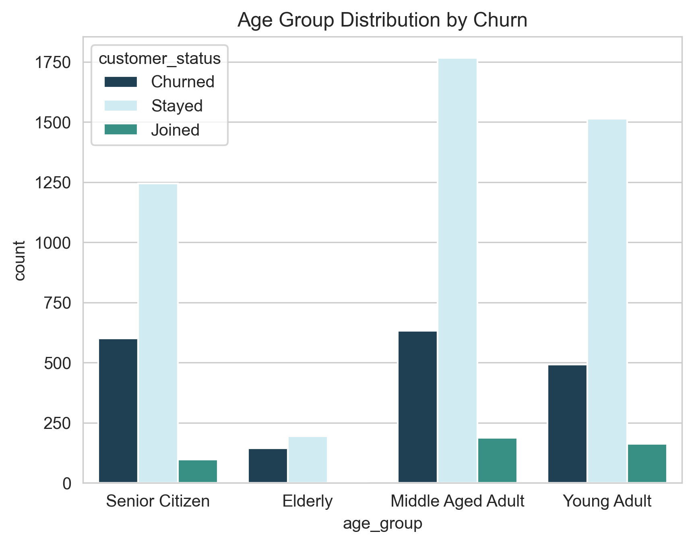
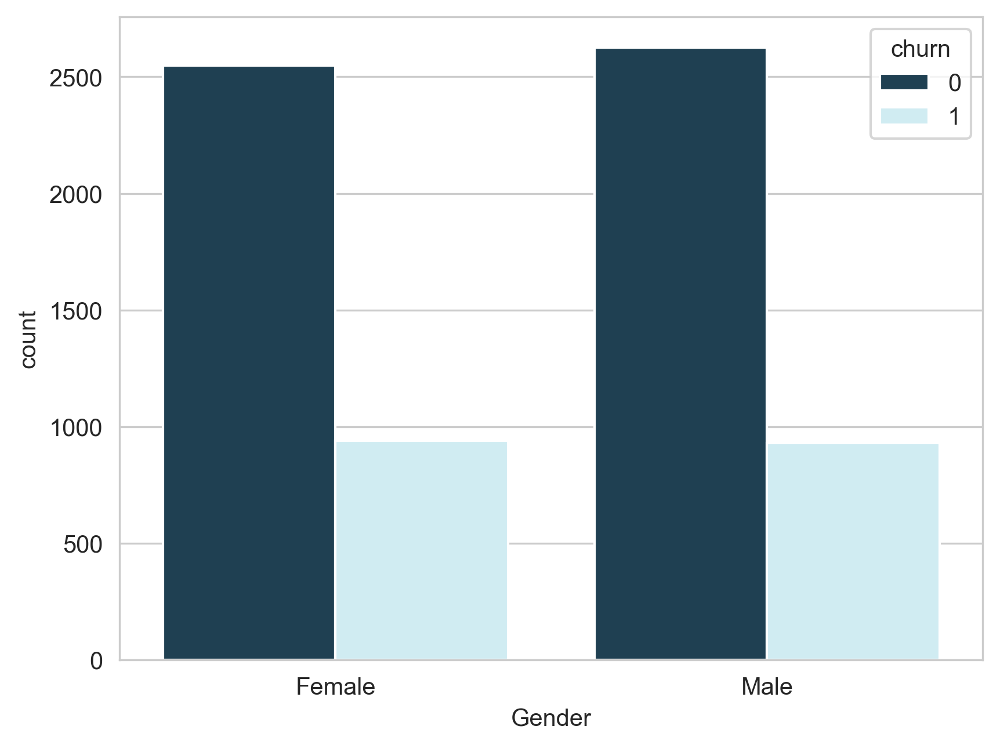
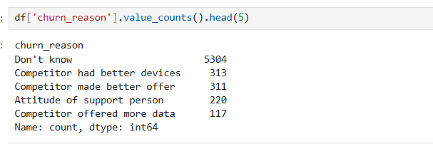
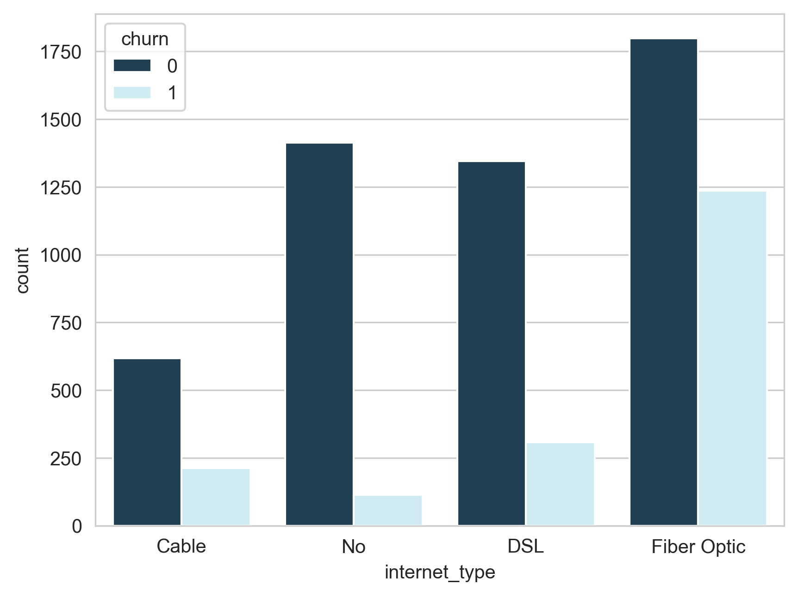

# customer-churn-analysis-and-prediction
## Description
This project aims to predict customer churn in subscription based services using Python, SQL, and Power BI.

## Table of Contents

- [Project Overview](#project-overview)
- [Dataset](#dataset)
- [Methodology](#methodology)
- [Results](#results)
- [Power BI Dashboard](#power-bi-dashboard)
- [Future Improvements](#future-improvements)
- [Contact](#contact)

## Project Overview

Customer churn refers to the phenomenon where customers stop using a company’s services within a specific period. For subscription-based businesses like telecom providers, understanding and predicting churn is critical, as retaining existing customers is generally more cost-effective than acquiring new ones. The project utilizes SQL for data handling, Python for data analysis and modeling and Power BI to create an interactive dashboard that visualizes key insights and trends related to churn.
  
## Dataset

The Customer Churn dataset contains information on all 7,043 customers from a Telecommunications company in California. Each record represents one customer and contains details about their demographics, location, tenure, contract types, subscription services, customer status etc. Churn label is the target.
### Source
Publically available telecom customer churn Kaggle dataset in csv format.( https://www.kaggle.com/datasets/alfathterry/telco-customer-churn-11-1-3/data )
The dataset has approximately 7,043 rows and 50 columns, with each row representing an individual customer.

## Methodology

### Project Workflow
1. Data collection and loading 
2. Cleaning and processing
3. Exploratory data analysis
4. Feature engineering
5. Model building and evaluation
6. PowerBi Dashboard

### 1.Data collection and loading
Initially i created a table telecom_analysis in database telecom in Postgresql and read the dataset as CSV file using pandas and then imported data to Postgresql table.

### 2.Data Cleaning and Preprocessing
To prepare the data for analysis and prediction, the following cleaning and preprocessing steps were performed:
**Column Dropping:** 
Irrelevant columns not required for analysis or prediction were removed from the dataset.
**Handling Missing Values:**
In the Internet Type column, missing values were replaced with "No" to indicate a lack of internet service.
In the Churn Category column, missing values were replaced with "Other".
In the Churn Reasons column, missing values were replaced with "Don't Know".
**New Column Creation:**
An age_group column was created by categorizing ages into Young Adult, Middle-Aged Adult, Senior Citizen, and Elderly to understand churn patterns across different age groups.
A high_revenue_customer column with boolean values was added based on Total Revenue to indicate customers who generate high revenue, providing insight into churn among valuable customers.
**Quering and Analysis:**
Did some basic quering to understand the churn rates among different Internet Types and contract length

### 3.Exploratory Data Analysis
The goal of this analysis is to identify patterns and factors that impact customer churn by examining several key features to understand their relationship with churn, using visuals to uncover insights.

**1.How does demographic factors like age and gender relate to churn?**
This plot shows Age group Distribution vs churn. Senior Citizens have a relatively high number of churned customers compared to other age groups and Middle-Aged Adults have the highest number of customers who have stayed. There is no patterns in Customer churn based on gender.

**2.What are the reasons for customer churn?**
Majority of customers did not specify a reason. This might indicate a lack of clear communication from customers. A significant number of customer churned due to competitors providing better device and better offers. Some are dissatisfied with the customer service.

**3.Which internet service type and contract type are most preferred?**
Most preferred internet service type amoung customers is fibre optic and dsl, fibre optics also have higher number of churn rate  compared to other types. Month to Month contract and two year contract types keep more customers. However customers who has month to month contract basis are more likely to churn.

