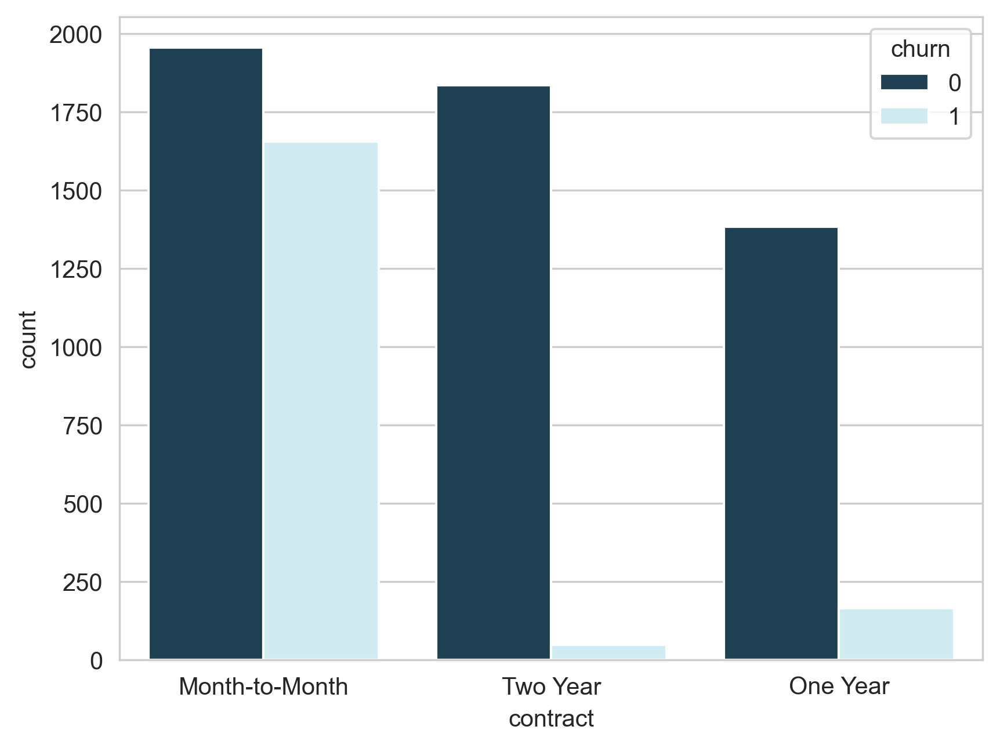
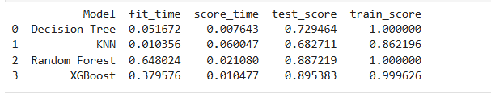
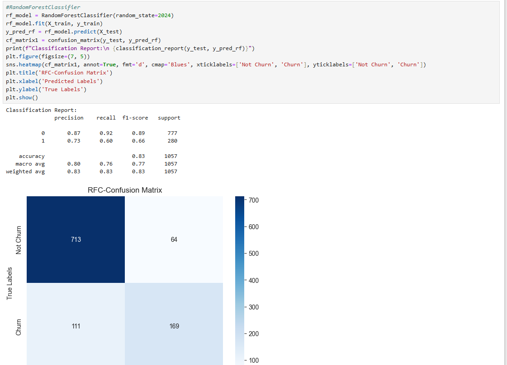
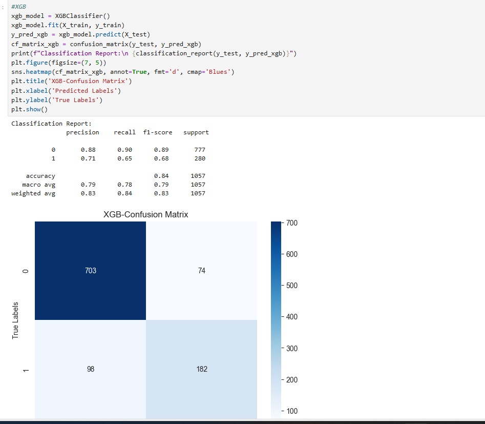
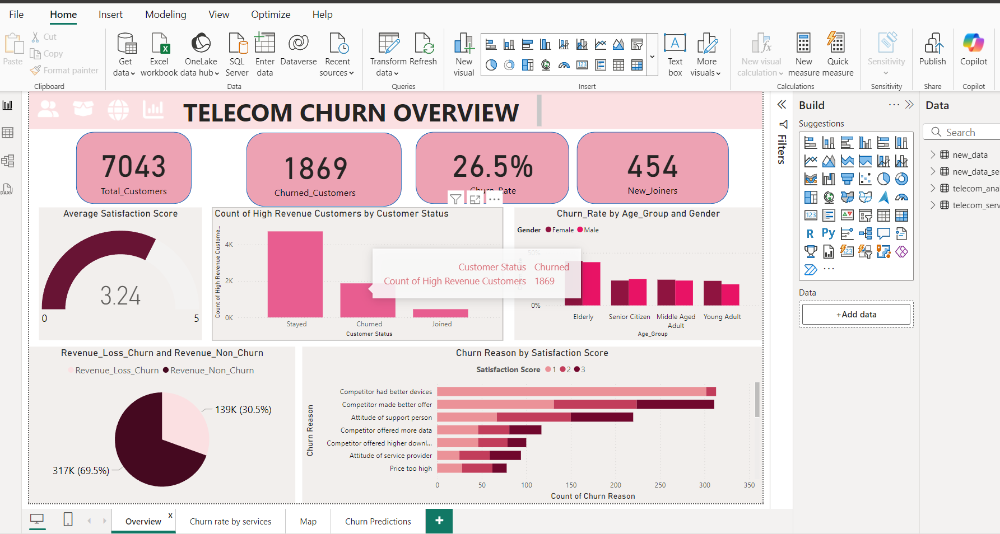
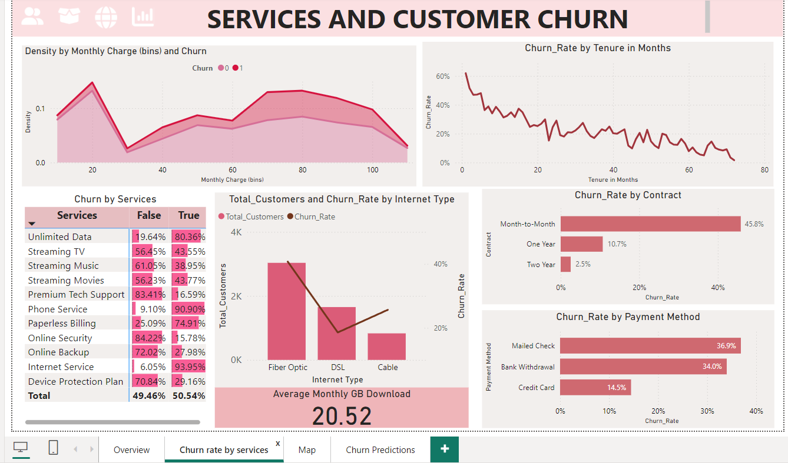
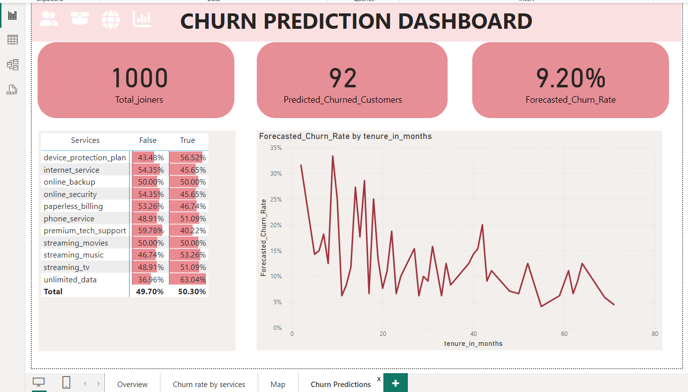

# customer-churn-analysis-and-prediction
## Description
This project aims to predict customer churn in subscription based services using Python, SQL, and Power BI.

## Table of Contents

- [Project Overview](#project-overview)
- [Dataset](#dataset)
- [Methodology](#methodology)
- [Results](#results)
- [Power BI Dashboard](#power-bi-dashboard)
- [Future Improvements](#future-improvements)
- [Contact](#contact)

## Project Overview

Customer churn refers to the phenomenon where customers stop using a company’s services within a specific period. For subscription-based businesses like telecom providers, understanding and predicting churn is critical, as retaining existing customers is generally more cost-effective than acquiring new ones. The project utilizes SQL for data handling, Python for data analysis and modeling and Power BI to create an interactive dashboard that visualizes key insights and trends related to churn.
  
## Dataset

The Customer Churn dataset contains information on all 7,043 customers from a Telecommunications company in California. Each record represents one customer and contains details about their demographics, location, tenure, contract types, subscription services, customer status etc. Churn label is the target.
### Source
Publically available telecom customer churn Kaggle dataset in csv format.( https://www.kaggle.com/datasets/alfathterry/telco-customer-churn-11-1-3/data )
The dataset has approximately 7,043 rows and 50 columns, with each row representing an individual customer.

## Methodology

### Project Workflow
1. Data collection and loading 
2. Cleaning and processing
3. Exploratory data analysis
4. Feature engineering
5. Model building and evaluation
6. PowerBi Dashboard

### 1.Data collection and loading
Initially i created a table telecom_analysis in database telecom in Postgresql and read the dataset as CSV file using pandas and then imported data to Postgresql table.

### 2.Data Cleaning and Preprocessing
To prepare the data for analysis and prediction, the following cleaning and preprocessing steps were performed:
**Column Dropping:** 
Irrelevant columns not required for analysis or prediction were removed from the dataset.
**Handling Missing Values:**
In the Internet Type column, missing values were replaced with "No" to indicate a lack of internet service.
In the Churn Category column, missing values were replaced with "Other".
In the Churn Reasons column, missing values were replaced with "Don't Know".
**New Column Creation:**
An age_group column was created by categorizing ages into Young Adult, Middle-Aged Adult, Senior Citizen, and Elderly to understand churn patterns across different age groups.
A high_revenue_customer column with boolean values was added based on Total Revenue to indicate customers who generate high revenue, providing insight into churn among valuable customers.
**Quering and Analysis:**
Did some basic quering to understand the churn rates among different Internet Types and contract length

### 3.Exploratory Data Analysis
The goal of this analysis is to identify patterns and factors that impact customer churn by examining several key features to understand their relationship with churn, using visuals to uncover insights.

**1.How does demographic factors like age and gender relate to churn?**
This plot shows Age group Distribution vs churn. Senior Citizens have a relatively high number of churned customers compared to other age groups and Middle-Aged Adults have the highest number of customers who have stayed. There is no patterns in Customer churn based on gender.

**2.What are the reasons for customer churn?**
Majority of customers did not specify a reason. This might indicate a lack of clear communication from customers. A significant number of customer churned due to competitors providing better device and better offers. Some are dissatisfied with the customer service.

**3.Which internet service type and contract type are most preferred?**
Most preferred internet service type amoung customers is fibre optic and dsl, fibre optics also have higher number of churn rate  compared to other types. Month to Month contract and two year contract types keep more customers. However customers who has month to month contract basis are more likely to churn.

**4.How does monthly charge, total charges, tenure in months impact churn?**
Customer with lower monthly charges are more likely to stay but customers with lower total charges are more likely to churn.This implies that customers on lower-cost plans may perceive greater value for the price, reducing their likelihood of leaving. Also newer customers, who haven’t invested as much financially in the service, may be quicker to leave if they encounter issues or don’t see value.Customer subscribed to short tenure mostly like to churn. Tenure in months and total charges are highly correlated.
Customers with high cltv are most likely to stays loyal. CLTV can serve as a predictive indicator of loyalty. High-CLTV customers are often more engaged and satisfied. 

### 4.Feature engineering
Feature engineering transforms raw data into meaningful features to improve model performance.
**Encoding Categorical Variables**
Categorical variables like gender, contract, internet_type, payment_method, and age_group were converted into numerical format using one-hot encoding.
**Converting Boolean Columns to Integers**
Any boolean columns were converted to integer format to ensure compatibility with machine learning algorithms, which often expect numerical inputs.
**Dropping Unnecessary Columns**
Certain columns that were unnecessary for the model were removed from the dataset to reduce noise and improve computational efficiency.
Identifiers and location information (customer_id, country, state, city)
Outcome variables and other post-churn information (customer_status, churn_category, churn_reason, churn_score, satisfaction_score, cltv)
Time period identifier (quarter)
**Scaling Numerical Features**
To ensure all features have a similar scale, numerical variables were scaled to a range between 0 and 1 using Min-Max Scaling. This scaling helps prevent features with larger ranges from dominating the model's learning process.

### 5.Model building and evaluation
In this project, 4 machine learning algorithms are selected and compared that are already in Scikit-Learn to choose the one that provide better performance.
1.RandomForestClassifier
2.DecisionTreeClassifier
3.KNeighborsClassifier
4.XGBoost Classifier   

**Data splitting**
 The data was split into training and test sets with an 85:15 ratio, using stratification to maintain the balance of the target variable (churn) across both sets.
**Cross Validation**
Each model was evaluated using 5-fold cross-validation on the training set. Cross-validation provides a robust measure of model performance by reducing the impact of data variability and helps identify the best-performing model before final testing.

**Performance Comparison**
XGBoost had the highest cross-validated test score (AUC-ROC = 0.8954), indicating it was the best performer at distinguishing between churned and non-churned customers.
Random Forest followed closely with an AUC-ROC of 0.8872, showing strong predictive capability as well.
Decision Tree and KNN showed lower test scores, suggesting they were less effective at capturing the complexity of the data.

**Evaluation and Interpretation**
After comparing the models with cross-validation, XGBoost and Random Forest were selected for further evaluation on the test set, as they demonstrated the best balance of predictive performance.
Both Random Forest model and XGBoost model was trained on the training set and evaluated on the test set. Key evaluation metrics, including the classification report and confusion matrix, are provided to assess model performance on unseen data.

RandomForestClassifier showed a 83% accuracy and weighted average metrics are consistent with overall performance.XGBooster accuracy of 84% indicates that the model performs well in distinguishing between customers who churn and those who stay. Precision and recall scores reveal that the model is particularly effective at identifying non-churners.
**Confusion matrix**

**RFC**
Succussfully predicted (TN)713 customers who dont churn and (TP)169 who churn.
There are (FP)64 customers who are predicted to churn when they actually wont churn and (FN)111 customers to not churn when they actually churn 

**XGB**
Succussfully predicted (TN)703 customers who dont churn and (TP)182 who churn.
There are (FP)74 customers who are predicted to churn when they actually wont churn and (FN)98 customers to not churn when they actually churn 

**Model Feature Importance**
![Feature Importance][def]

To further validate the model's robustness and applicability, a simulated dataset was generated based on the distribution of key features in the original dataset. This dataset included 1,000 samples with randomized values for numerical, boolean and categorical features, closely resembling the range and variability of the original data. The model was then used to predict churn on this simulated data, providing insights into how it performs with new, unseen records. This additional testing helps to assess the model's generalization ability and its potential for real-world application in predicting customer churn. The predicted churn labels were appended to the simulated data for further analysis.

## 6.PowerBi Dashboard

### 7.Observations and Recommendations
- **Churn Rate**: 1,869 customers (26.5%) churned.
- **New Joiners**: 454, showing efforts in customer acquisition.
- **Satisfaction**: Average score of 3.24 out of 5 indicates moderate satisfaction.
- **Revenue Impact**: 
  - Churned revenue: $139K (30.5%)
  - Retained revenue: $317K (69.5%)
- **High-Revenue Customers**: Significant losses due to churn, though many remain.
- **Churn by Demographics**: Balanced across genders and age groups.
- **Primary Churn Reasons**:
  - Competitor offers (better services/pricing).
  - Dissatisfaction with support or pricing.
  - Low satisfaction scores (1–2).
- **Monthly Charges**: High churn between $70–$100, suggesting perceived expense.
- **Tenure**: 
  - Shorter tenure (<10 months) has higher churn.
  - Long-term customers are more likely to stay.
- **Contracts**:
  - Month-to-month: 45.8% churn.
  - One-year: 10.7%; two-year: 2.5% churn—indicating higher loyalty with longer contracts.
- **Payment Methods**:
  - Mailed check (36.9%) and bank withdrawal (34%) correlate with higher churn.
  - Credit card (14.5%) shows greater stability.
- **High-Churn Services**:
  - Streaming TV (56.4%), Streaming Music (61.0%), Streaming Movies (56.2%).
  - Lower churn in Online Security (15.8%) and Backup (16.9%).
- **Fiber Optic Users**: Higher churn rate than DSL, possibly due to pricing/service issues.

### Recommendations
1. **Improve Satisfaction**: Target high-revenue customers with enhanced support.
2. **Address Competitor Threats**: Adjust pricing and offers to be competitive.
3. **Enhance Retention**: Focus on month-to-month customers; offer incentives for longer-term contracts.
4. **Optimize Streaming Services**: Address costs and improve quality to retain subscribers.
5. **Focus on Fiber Optic Users**: Investigate and resolve service-related issues.
6. **Customer Feedback**: Conduct regular satisfaction surveys and feedback sessions.
7. **Loyalty Programs**: Offer discounts and rewards for long-term customers.

[def]: images/plot6.png